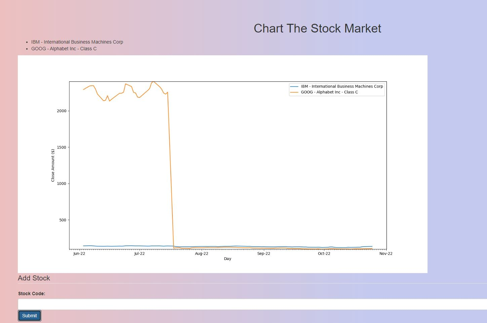

# Flask-stockMarketChart

Chart the stock market

Uses [Alpha Vantage to get the data](https://www.alphavantage.co/documentation/)

Make as part of [FreeCodeCamp's challenge](https://www.freecodecamp.org/learn/coding-interview-prep/take-home-projects/chart-the-stock-market)

[Link to live project](https://limitless-ridge-52978.up.railway.app/)

Also at [stocks.link477.com](https://stocks.link477.com/)



## JavaScript Transpile

Use `tsc stocks.ts --target es2015 --moduleResolution node` to transpile the TypeScript into JavaScript.

Use `npm run build` to combine the JavaScript files into one file using WebPack.

<!-- To minify the JavaScript I used [the JavaScript minifier](https://www.toptal.com/developers/javascript-minifier) -->

## Docker

Build with:

```bash
docker build -t stockmarketchart .
```

Run with:

```bash
docker run -d -p 5000:5000 stockmarketchart
```
