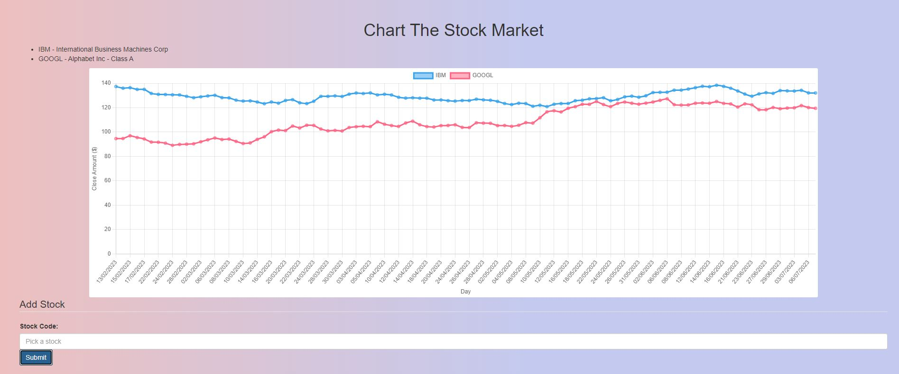

# Flask-stockMarketChart

Chart the stock market

Uses [Alpha Vantage to get the data](https://www.alphavantage.co/documentation/)

Make as part of [FreeCodeCamp's challenge](https://www.freecodecamp.org/learn/coding-interview-prep/take-home-projects/chart-the-stock-market)

[Link to live project](https://limitless-ridge-52978.herokuapp.com/static/index.html)



To minify the JavaScript I used [the JavaScript minifier](https://www.toptal.com/developers/javascript-minifier)

## Docker

Build with:

```bash
docker build -t stockmarketchart .
```

Run with:

```bash
docker run -dp 5000:5000 stockmarketchart
```

## Python Environment

```bash
# Create environment
python3 -m venv smc

# Activate environment (Linux/Mac)
source smc/bin/activate

# Activate environment (Windows)
smc\Scripts\activate.ps1

# Install required packages
python3 -m pip install -r requirements.txt
```

## Heroku

Old procfile command

```bash
web: gunicorn wsgi:app
```

To send to heroku use:

```bash
git push heroku
```

(sign into the Heroku cli with heroku login)
